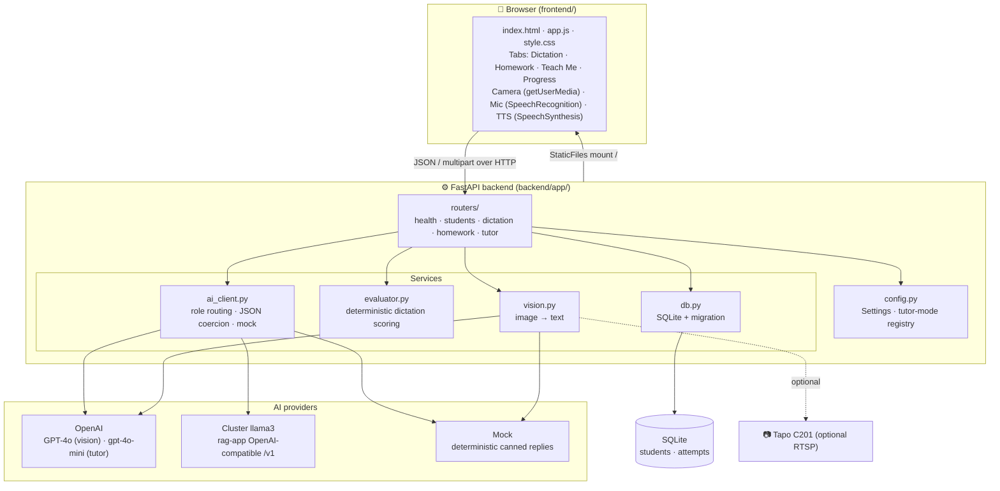
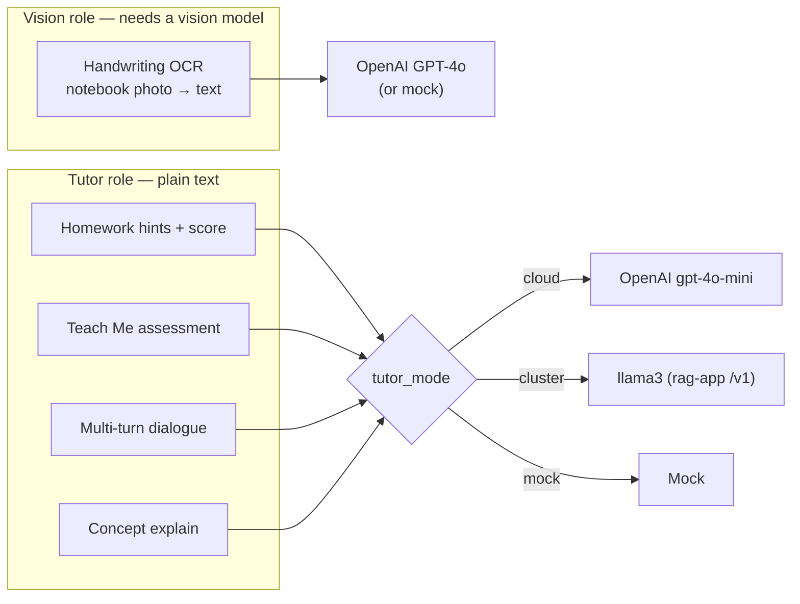
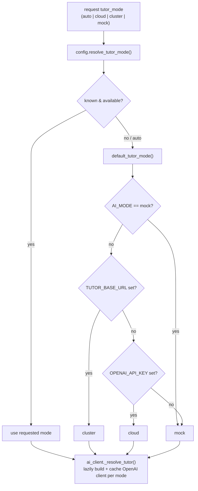
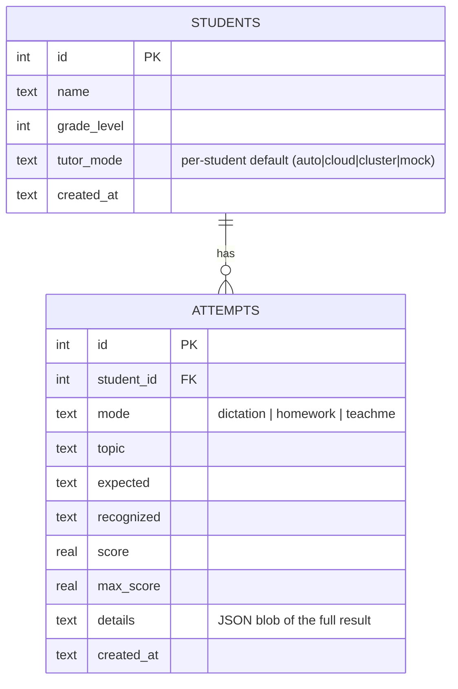
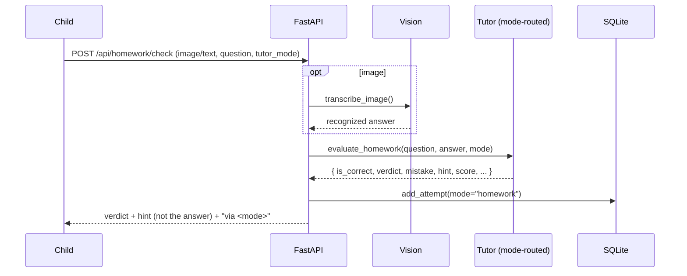
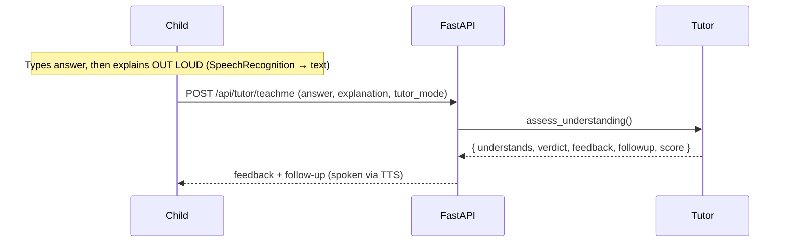
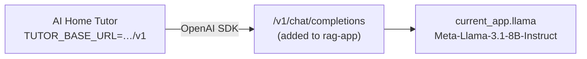
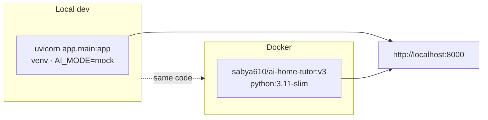

# AI Home Tutor — Architecture & Workflow

A privacy-first study mentor for kids. A camera (or typed input) captures the
child's work **only on demand**; the app reads it, grades it, gives hints
instead of answers, tracks progress, and can hold a spoken back-and-forth
"teach me" dialogue. This document explains how the pieces fit together and how
data flows through each feature.

---

## 1. Design principles

| Principle | How it shows up |
|---|---|
| **Privacy-first** | No continuous video. Frames are captured only on a button press; only a single snapshot (or typed text) leaves the browser. Learning data stays in a local SQLite file. |
| **Two AI roles, routed independently** | *Vision* (handwriting→text) needs a vision model; *Tutor* (hints/scoring/dialogue) is plain text and can run on a different provider (OpenAI **or** cluster llama3). |
| **Deterministic where possible** | Dictation grading is pure Python (`difflib`) — no LLM — so it is exact and unit-testable. The AI only turns a photo into text. |
| **Offline mock mode** | Every AI call has a deterministic mock, so the whole app runs and is fully testable with **no API key**. |
| **Safe provider selection** | The browser only ever sends a mode *name* (`cloud`/`cluster`/`mock`); the server maps it to a pre-configured endpoint. No URLs/keys come from the client (no SSRF). |

---

## 2. High-level architecture



**Request path in one line:** browser → FastAPI router → (vision → text) → service
(evaluator / ai_client) → SQLite → JSON response → browser renders + speaks.

---

## 3. Directory structure

```
ai-home-tutor/
├─ backend/
│  ├─ app/
│  │  ├─ main.py          FastAPI app; mounts routers + static frontend; db.init_db()
│  │  ├─ config.py        Settings (env/.env); AI-role targets; tutor-mode registry
│  │  ├─ ai_client.py     AIClient: vision + tutor calls, per-mode client cache,
│  │  │                    JSON coercion, mock; homework / teachme / conversation
│  │  ├─ vision.py        image_to_text(); Tapo RTSP snapshot (optional OpenCV)
│  │  ├─ evaluator.py     score_dictation() — pure, deterministic
│  │  ├─ db.py            SQLite: students, attempts, progress, idempotent migration
│  │  ├─ schemas.py       Pydantic request/response models
│  │  └─ routers/         health · students · dictation · homework · tutor
│  ├─ tests/              pytest: evaluator, api, providers (+ manual_smoke.py)
│  ├─ requirements.txt / -dev.txt / -tapo.txt
│  └─ pytest.ini
├─ frontend/              index.html · app.js · style.css  (vanilla, no build step)
├─ cluster/               rag_app_openai_endpoint.py (+ README) — reuse cluster llama3
├─ Dockerfile             python:3.11-slim; copies backend + frontend
├─ docker-compose.yml     service on :8000, env_file .env, data volume
├─ .env / .env.example    runtime config (mock by default)
└─ README.md              quickstart · this file is the deep dive
```

---

## 4. The two AI roles

The AI is split by **capability**, not by vendor:



> **llama3 is text-only** — it cannot do handwriting OCR. So vision stays on
> OpenAI (or the child types), while the tutor can run on cluster llama3.

### Tutor-mode resolution (server-side)



`tutor_mode_targets()` builds the set the UI can pick from (`cluster`, `cloud`,
`mock`) with labels; `GET /api/tutor/modes` exposes it to the toggle. For a
custom (`cluster`) endpoint the client falls back to **prompt-based JSON** with
tolerant parsing (`coerce_homework` / `coerce_teachme*`), because many llama.cpp
builds reject OpenAI JSON mode.

---

## 5. Data model (SQLite)



`db.progress(student_id)` aggregates attempts by topic → averages, weak topics
(<70%), and a recommendation. Schema upgrades are handled by
`_ensure_columns()` (idempotent `PRAGMA table_info` + `ALTER TABLE ADD COLUMN`),
so old databases migrate on startup.

---

## 6. API reference

| Method | Path | Purpose |
|---|---|---|
| GET | `/api/health` | Status + per-role provider info (mock flags, endpoints) |
| GET | `/api/health/llm` | Live one-token ping to the tutor endpoint |
| GET | `/api/students` | List students |
| POST | `/api/students` | Create student (`name`, `grade_level`, `tutor_mode`) |
| PUT | `/api/students/{id}/tutor-mode` | Save per-student tutor preference |
| GET | `/api/students/{id}/progress` | Averages, weak topics, recommendation |
| GET | `/api/dictation/new?level=` | Fetch a sentence to dictate |
| POST | `/api/dictation/check` | Grade handwriting vs expected (deterministic) |
| POST | `/api/homework/check` | Read Q+A, find mistake, hint, 0–10 score |
| GET | `/api/tutor/modes` | Tutor providers for the UI toggle |
| POST | `/api/tutor/explain` | Explain a concept at grade level |
| POST | `/api/tutor/teachme` | Single-turn understanding check |
| POST | `/api/tutor/teachme/turn` | One turn of a multi-turn dialogue (stateless) |

Image endpoints accept **either** an uploaded `image` **or** `recognized_text`
(typed / testing), so every flow works without a camera.

---

## 7. Feature workflows

### 7.1 Dictation (deterministic, no LLM for grading)

```mermaid
sequenceDiagram
    participant C as Child (browser)
    participant API as FastAPI
    participant AI as Vision (OpenAI/mock)
    participant EV as evaluator.py
    participant DB as SQLite

    C->>API: GET /api/dictation/new?level=2
    API-->>C: { sentence }
    Note over C: TTS reads sentence aloud;<br/>child writes it in the notebook
    C->>API: POST /api/dictation/check (image or recognized_text, expected)
    alt image provided
        API->>AI: transcribe_image()
        AI-->>API: recognized text
    end
    API->>EV: score_dictation(expected, recognized)
    EV-->>API: spelling/missing/caps/punct + overall (0–10)
    API->>DB: add_attempt(mode="dictation")
    API-->>C: breakdown + feedback
```

Scoring uses `difflib.SequenceMatcher` on normalized word lists to align, then
counts missing / extra / misspelled / capitalization / punctuation errors and a
weighted overall score — fully deterministic and unit-tested.

### 7.2 Homework check



### 7.3 Teach Me — single turn



### 7.4 Teach Me — multi-turn conversation (stateless)

The client keeps the running transcript and resends it each turn; the server
stays stateless. A **turn cap** (`max_turns=5`) force-ends the dialogue so it
can never loop forever. An attempt is saved to Progress **only when `done`**.

```mermaid
sequenceDiagram
    participant C as Child
    participant API as FastAPI
    participant T as Tutor
    participant DB as SQLite

    loop until done (or cap)
        Note over C: speak / type this turn's explanation
        C->>API: POST /api/tutor/teachme/turn (full turns[], answer, tutor_mode)
        API->>T: converse_teachme(turns) — child→user, tutor→assistant
        T-->>API: { understands, done, feedback, followup, score }
        alt not done
            API-->>C: followup (spoken); child answers next turn
        else done (understood or cap reached)
            API->>DB: add_attempt(mode="teachme", transcript)
            API-->>C: final score + wrap-up
        end
    end
```

### 7.5 Tutor toggle + per-student preference

```mermaid
sequenceDiagram
    participant C as Parent/Child
    participant UI as app.js
    participant API as FastAPI
    participant DB as SQLite

    UI->>API: GET /api/tutor/modes
    API-->>UI: { default, modes:[cloud, cluster, mock] }
    Note over UI: build header <select>; restore per-student pref
    C->>UI: switch student
    UI->>UI: applyStudentTutorPref() sets toggle
    C->>UI: change toggle
    UI->>API: PUT /api/students/{id}/tutor-mode { tutor_mode }
    API->>DB: validate (auto ∪ available) → persist
    Note over UI: also cached in localStorage
```

Precedence when choosing the tutor: **per-student pref → localStorage → server
default**.

---

## 8. Camera & privacy

- **Capture:** `getUserMedia` streams to a `<video>`; a snapshot is drawn to a
  `<canvas>` and sent **only** when a Check button is pressed.
- **On/off:** the camera button is a Start/Stop toggle; Stop calls
  `track.stop()` on every track to release the device (webcam light goes off).
- **Voice:** Teach Me uses the Web Speech API (`SpeechRecognition` for input,
  `SpeechSynthesis` to speak follow-ups) — independent of the camera.
- **Tapo C201:** `vision.capture_tapo_frame()` can pull a still from an RTSP
  camera (`TAPO_RTSP_URL`, needs `requirements-tapo.txt`); off by default.

---

## 9. Cluster llama3 integration

The rag-app serves llama3 (llama.cpp) but exposes only an HTML RAG form. The
add-on [cluster/rag_app_openai_endpoint.py](cluster/rag_app_openai_endpoint.py)
adds an **OpenAI-compatible `/v1/chat/completions`** that reuses the
already-loaded model (no second 8B load). Point the tutor at it:



Reach it via `kubectl port-forward svc/rag-app-service 8080:80` (local) or
in-cluster DNS (`rag-app-service.rag-app.svc.cluster.local`). See
[cluster/README.md](cluster/README.md).

---

## 10. Configuration (env / `.env`)

| Variable | Default | Meaning |
|---|---|---|
| `AI_MODE` | `auto` | `auto` (real when a key/endpoint exists) · `openai` · `mock` |
| `OPENAI_API_KEY` | — | Shared key for both roles unless overridden |
| `OPENAI_BASE_URL` | — | Shared OpenAI-compatible base URL |
| `VISION_MODEL` | `gpt-4o` | Handwriting OCR model |
| `VISION_BASE_URL` / `VISION_API_KEY` | — | Per-role vision overrides |
| `TUTOR_MODEL` | `gpt-4o-mini` | Tutor model (set to `llama3.1-8b` for cluster) |
| `TUTOR_BASE_URL` | — | Cluster llama3 endpoint (`…/v1`) |
| `TUTOR_API_KEY` | — | Tutor key (`not-needed` for llama.cpp) |
| `TUTOR_JSON_MODE` | `auto` | `auto` · `json` (native) · `prompt` (parse) |
| `CLOUD_TUTOR_MODEL` | `gpt-4o-mini` | Cloud model when default tutor is the cluster |
| `DB_PATH` | `data/tutor.db` | SQLite location |
| `TAPO_RTSP_URL` | — | Optional Tapo/RTSP source |
| `CORS_ORIGINS` | `*` | Allowed origins |

---

## 11. Deployment



- **Dev:** `uvicorn app.main:app` from `backend/.venv` (serves UI at `/`).
- **Docker:** `docker build -t sabya610/ai-home-tutor:v3 .` then `docker run -p 8000:8000`.
- **Compose:** `docker compose up` (reads `.env`, mounts `./data`).
- The `Dockerfile` copies only `backend/` + `frontend/`; tests, `.venv`,
  `data/`, and `.env` are excluded via `.dockerignore`.

---

## 12. Testing

- **Unit** ([test_evaluator.py](backend/tests/test_evaluator.py)) — dictation
  scoring counts/scores are pinned exactly.
- **Providers** ([test_providers.py](backend/tests/test_providers.py)) — mode
  selection, JSON extraction, homework/teachme coercion.
- **API** ([test_api.py](backend/tests/test_api.py)) — every endpoint via
  `TestClient` in mock mode, including multi-turn convergence and the migration.
- Run: `cd backend; .\.venv\Scripts\python.exe -m pytest -q` (all in mock mode,
  no network).
- **Live smoke:** [backend/tests/manual_smoke.py](backend/tests/manual_smoke.py)
  hits a running server (`python manual_smoke.py http://127.0.0.1:8000`).
